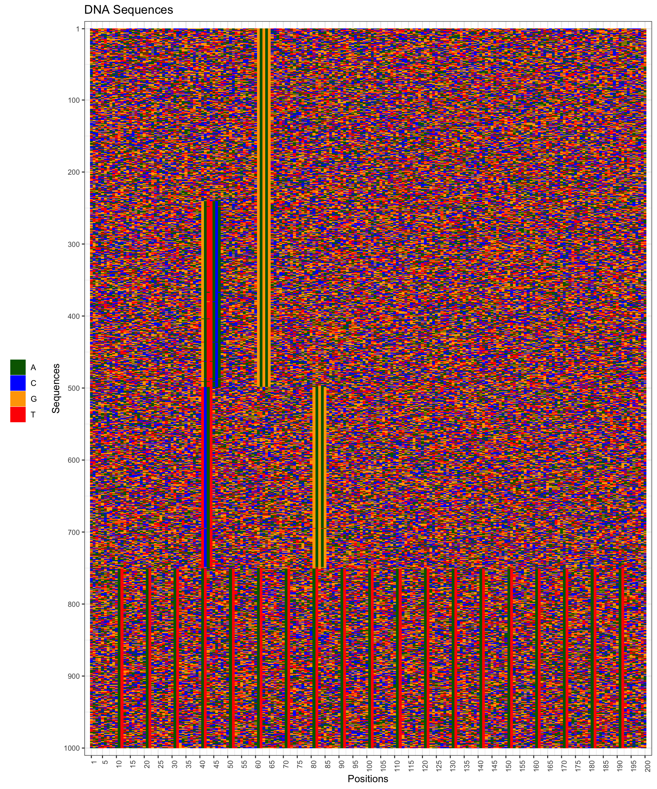

```{r setup, include=FALSE}
knitr::opts_chunk$set(
  collapse = TRUE,
  comment = "#>"
)

```

# Introduction
_archR_ is a non-negative matrix factorization (NMF)-based unsupervised learning 
approach for identifying different (core promoter) sequence architectures. We 
demonstrate in this vignette that archR's simple algorithm based on chunking and
iterative processing successfully uncovers hidden clusters characterized by 
combinations of sequence motifs. 
To our knowledge, this is a novel application of NMF on sequence data where
motifs, their positional specificities and complex inter-relationships, all are 
simultaneously inferred from the data.

# Installation
```archR``` can be installed as follows.
```{r archR-install, echo=TRUE, eval=FALSE}
# install.packages("devtools")
devtools::install_github("snikumbh/archR", build_vignettes = TRUE)
```

# Working with archR
```{r setup-two, echo=TRUE}
# Load archR
library(archR)
reticulate::source_python(system.file("python/perform_nmf.py",
                                          package = "archR",
                                          mustWork = TRUE)
    )
seed_val <- 11992288
set.seed(seed_val)

```

## Synthetic data explained

In order to demonstrate the efficacy of _archR_, we use _archR_ to cluster DNA 
sequences in a synthetic data set generated as follows. A set of 1000 simulated 
DNA sequences was generated, each 200 nucleotides long and with uniform 
probability for all nucleotides. These sequences have four clusters in them, 
each with 250 sequences. The profiles of the four clusters are:


| Cluster | Characteristic Motifs | Motif Occurrence Position | #Sequences 
|----------|:----------|:----------|----------
| A | Dinucleotide repeat `AT` | every 10 nt | 250
| B | `GATTACA` | 40 | 250
|   | `GAGAG` | 60 |
| C | `GAGAG` | 60 | 250
| D | `GAGAG` | 80 | 250
|   | `TCAT`  | 40 |
<!-- ----------|----------|----------|----------| -->

All the motifs across the clusters were planted with a mutation rate of 0.


## Feature representation

We use one-hot encoding to represent each sequence in the data set. 

The function `prepare_data_from_FASTA` provides with the functionality to 
produce one-hot encoded DNA sequences stored in a FASTA file.
Setting the logical argument `rawSeq` to `TRUE`, the function returns the raw 
sequences as a `DNAStringSet` object, with `FALSE` it returns the coulmn-wise 
one-hot encoded representation, i.e., sequences are arranged along the columns.

```{r load-example-data, echo=TRUE}
# Creation of one-hot encoded data matrix from FASTA file
inputFastaFilename <- system.file("extdata", "example_data.fa", 
                                  package = "archR", 
                                  mustWork = TRUE)
tssSeqsOriginal <- prepare_data_from_FASTA(inputFastaFilename)
tssSeqsOriginal_raw <- prepare_data_from_FASTA(inputFastaFilename, 
                                               rawSeq = TRUE)
nSeqs <- ncol(tssSeqsOriginal)
positions <- seq(1,200)
sinuc <- c('A', 'C', 'G', 'T')

```

If you already have a `BiocStrings::DNAStringSet` object, you can use the 
`get_one_hot_encoded_seqs` function which directly accepts a `DNAStringSet` 
object.
```{r load-example-data-2, echo=TRUE, eval=TRUE}
# Creation of one-hot encoded data matrix from a DNAStringSet object
tssSeqs_direct <- get_one_hot_encoded_seqs(tssSeqsOriginal_raw)
identical(tssSeqs_direct, tssSeqsOriginal)
```

The FASTA file contained the sequences ordered according to the clusters, hence 
we shuffle them prior to processing with _archR_.
```{r shuffle-data, eval=TRUE, echo=TRUE}
# Randomize the sequence order
changedOrder <- sample.int(nSeqs, nSeqs, replace = FALSE)
tssSeqs <- tssSeqsOriginal[ , changedOrder]
tssSeqs_raw <- tssSeqsOriginal_raw[changedOrder]
```

## Visualize sequences as an image

```{r plot-seqs, echo=TRUE, fig.height=6, fig.width=5}
# Visualize original and randomized sequence matrix
visualize_matrix_of_acgt(as.character(tssSeqsOriginal_raw), 
                          position_labels = positions, 
                          saveFilename = NULL, 
                          plot.title = "Original Sequences")

visualize_matrix_of_acgt(as.character(tssSeqs_raw), position_labels = positions, 
                          saveFilename = NULL, 
                          plot.title = "Randomized Sequences")

```


## Calling _archR_


```{r setup-timing, echo=FALSE, eval=TRUE}
sTime <- Sys.time()
```
```{r call-archR, echo=TRUE}
# Set archR configuration
thisConfig <- archR::archRSetConfig(innerChunkSize = 500,
                                    kMin = 1, kMax = 8, parallelize = FALSE, 
                                    cvFolds = 3, nIterationsUse = 10,
                                    nCoresUse = NA)
# Call archR
archRresult <- archR::archR(config = thisConfig, 
                            tss.seqs = tssSeqs)
```
```{r setup-timing-end, echo=FALSE, eval=TRUE}
print(Sys.time() - sTime)
```

## Understanding the result object from _archR_

In the current version, _archR_ naively returns a result object which is a list of
lists.
The elements include: (a) the sequence cluster labels per iteration; (b) the 
collection of NMF basis vectors per iteration; (c) the configuration setting 
used; and (d) the call itself.

### Sequence cluster labels
For each sequence, _archR_ provides the cluster label for the sequence in each 
iteration separated by a hyphen. 
This is similar to labelling nodes in a tree, in which the label for any node 
denotes the path from the root to that node traversing intermediate nodes.
For example, cluster label for a sequence can look like "0-3-1-2". Here, "0" is 
denotes the root (all data), the sequence was assigned to cluster 3 in the 
first iteration (among all sequences in the data set), then to cluster 1 in the 
second iteration (among sequences in cluster 3 from first iteration), and 
subsequently, to cluster 2 in the final iteration.
For instance, below are the cluster labels for the first few sequences in the 
data.
```{r archR-result-seqs-clust-labels}
head(archRresult$seqsClustLabels)

```

### NMF basis vectors
_archR_ also stores the NMF basis vectors corresponding to each cluster in every 
iteration in the lust variable `clustBasisVectors`. `clustBasisVectors` is a 
numbered list corresponding to the number of iterations performed.
This is then again a list holding two pieces of information: the number of 
basis vectors (`nBasisVectors`/`numeric`) and the basis vectors 
(`basisVectors`/`matrix`).

```{r archR-result-clust-factors}
# archRresult$clustFactors

# Basis vectors at iteration 2
archRresult$clustBasisVectors[[2]]$nBasisVectors
dim(archRresult$clustBasisVectors[[2]]$basisVectors)
head(archRresult$clustBasisVectors[[2]]$basisVectors)
```


## Visualize results from _archR_

In this section we demonstrate how to visualize results from _archR_. 
One can visualize the NMF basis vectors as well as the sequence clusters.

### Visualizing NMF basis vectors at any iteration
We can visualize the basis vectors corresponding to each cluster at any 
iteration. 
These per-iteration basis vectors are available from the `archRresult` object 
(see above Section).

```{r viz-BV-1, echo=TRUE, fig.height=2, fig.width=25}
viz_all_factors_as_seqlogo(archRresult$clustBasisVectors[[1]]$basisVectors,
                            position_labels = positions,
                            plotMethod = "bits")

viz_all_factors_as_heatmap(archRresult$clustBasisVectors[[1]]$basisVectors,
                           position_labels = positions)
```


```{r viz-BV-2, fig.height=2, fig.width=25, echo=TRUE}
archR::viz_all_factors_as_seqlogo(
  archRresult$clustBasisVectors[[2]]$basisVectors,
  position_labels = positions,
  plotMethod = "bits"
)

archR::viz_all_factors_as_heatmap(
  archRresult$clustBasisVectors[[2]]$basisVectors,
  position_labels = positions)
```


```{r visualize-basis-vectors-combined, echo=TRUE, fig.height=4, fig.width=25}
archR::viz_all_factors_in_combined_heatmaps_seqlogos(
  archRresult$clustBasisVectors[[2]]$basisVectors,
  position_labels = positions,
  plotMethod = "bits"
)
```
The `plotMethod` argument to functions producing sequence logos is supplied to 
the call to `ggseqlogo`. The possible values are `custom`, `bits`.

The clustered output from _archR_ can again be visualized as a matrix. Simply 
sort the sequences based on the cluster labels assigned to them and call 
`archR::visualize_matrix_of_acgt` with the sorted order as shown.
```{r visualize-clusters, echo=TRUE, fig.height=6, fig.width=5, eval=FALSE}
sorted_order <- 
  sort(collect_cluster_labels(archRresult$seqsClustLabels, choose_levels = 3),
                    index.return = TRUE)
archR::visualize_matrix_of_acgt(as.character(tssSeqs_raw[sorted_order$ix]), 
                         position_labels = positions,
                         annClusters = sorted_order$x,
                         saveFilename = NULL)
```



The output in Figure 1 was generated by performing 100 bootstrapped iterations, 
parallely by setting the following configuration parameters to _archR_:
`nIterations = 100, nCoresUse = 4, parallelize = TRUE`.

# Conclusion

_archR_ can detect _de novo_ sequence features and simultaneously identify the 
complex interactions of different features together with their positional 
specificities.

Note that the sequence architectures identified by archR have no limitations 
due to the size of or gaps in the motifs, distance between motifs, compositional
and positional variations in the individual motifs and their effects on the 
complex interactions, and number of motifs involved in any interaction. 
It is advisable to perform a large number of bootstrapped iterations for NMF in 
_archR_. This potentially affects the computation time of _archR_. But being an 
embarrasingly parallelizable case, this issue is alleviated. There are already 
provisions in _archR_ to choose parallelization for speeding up computations.

# Session Info
```{r session_info, include=TRUE, echo=TRUE, results='markup'}
sessionInfo()
```
