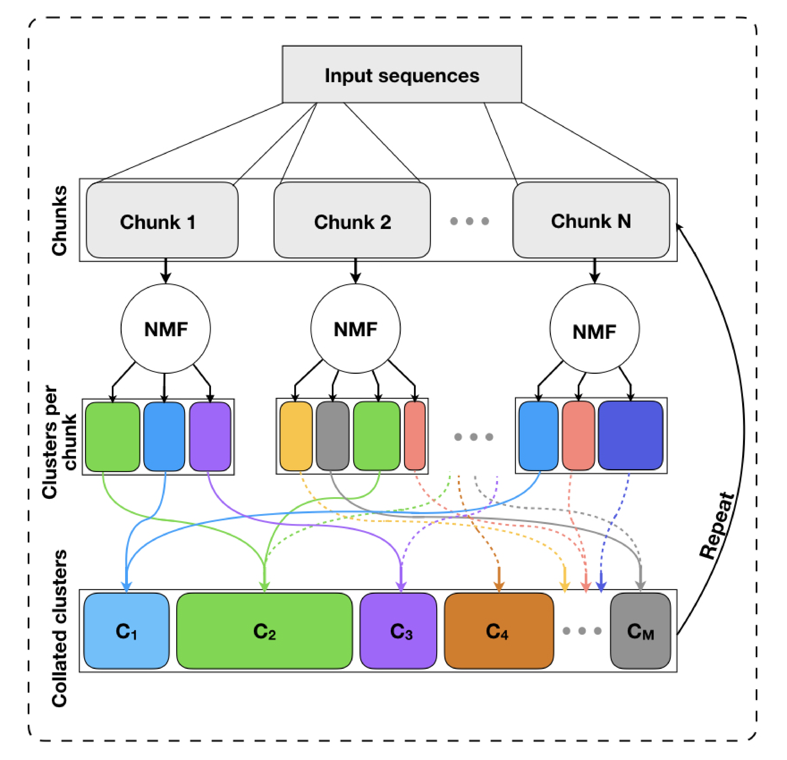
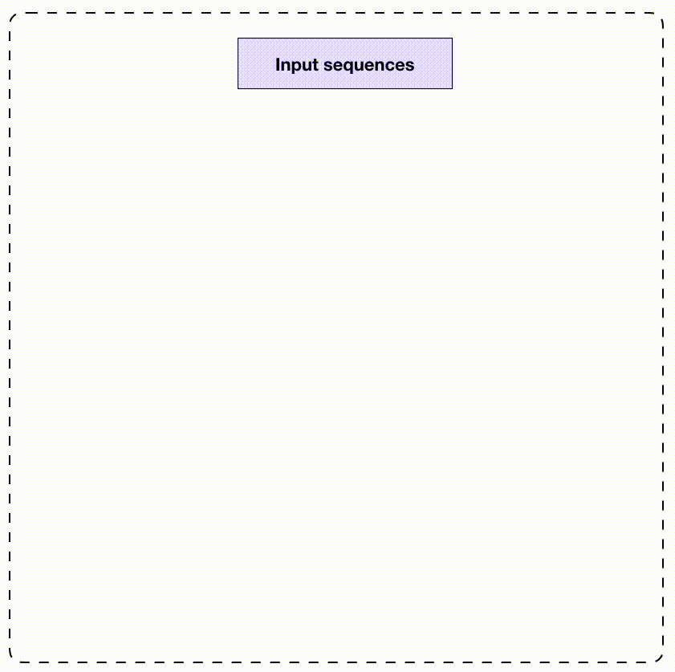

```{r setup, include=FALSE}
knitr::opts_chunk$set(
  collapse = TRUE,
  comment = "#>"
)

```

# Introduction
_archR_ is a non-negative matrix factorization (NMF)-based unsupervised 
learning approach for identifying different core promoter sequence 
architectures. 
_archR_ implements an algorithm based on chunking and iterative 
processing. 
While matrix factorization-based applications are known to scale poorly for 
large amounts of data, archR's algorithm enables scalable 
processing of large number of sequences.
A notable advantage of archR is that the sequence motifs -- the lengths and 
positional specificities of individual motifs, and complex inter-relationships 
where multiple motifs are at play in tandem, all are simultaneously inferred 
from the data.
To our knowledge, this is a novel application of NMF on biological sequence data
 capable of simultaneously discovering the sequence motifs and their positions.
For a more detailed discussion, see preprint/publication [TODO: link here].


This vignette demonstrates _archR_'s usage with the help of a synthetic DNA 
sequences data set. 
Please refer to the paper (TODO: cite paper/preprint) for a detailed 
description of _archR_'s algorithm.
The paper also discusses the various parameters and their settings.
For completeness, the following section gives a brief overview of the algorithm.

# _archR_'s algorithm
_archR_ implements a chunking-based iterative procedure. Below is a 
schematic of archR's algorithm.



<!--  -->
<!--  -->


Further details to follow.

# Installation
_archR_ is currently made available via GitHub, thus, you can use the 
following procedure for installing _archR_.
```{r archR-install, echo=TRUE, eval=FALSE}
install.packages("remotes")
remotes::install_github("snikumbh/archR")
 
```
In case of any errors, please consider looking up [https://github.com/snikumbh/archR](https://github.com/snikumbh/archR). 
If none of the already noted points with regards to troubleshooting
_archR_'s installation help, please file a 
[new issue](https://github.com/snikumbh/archR/issues/new).


# Working with _archR_
```{r setup-two, echo=TRUE}
# Load archR
library(archR)
library(Biostrings, quietly = TRUE)


# Set seed for reproducibility
seed_val <- 11992288
set.seed(seed_val)

```

## Synthetic data explained

In order to demonstrate the efficacy of _archR_, we use _archR_ to cluster DNA 
sequences in a synthetic data set which was generated as follows. 
A set of 200 simulated DNA sequences was generated, each 100 nucleotides long 
and with uniform probability for all nucleotides. 
These sequences have four clusters in them, each with 50 sequences. 
The profiles of the four clusters are:


| Cluster | Characteristic Motifs | Motif Occurrence Position | #Sequences 
|----------|:----------|:----------|----------
| A | Dinucleotide repeat `AT` | every 10 nt | 50
| B | `GATTACA` | 40 | 50
|   | `GAGAG` | 60 |
| C | `GAGAG` | 60 | 50
| D | `GAGAG` | 80 | 50
|   | `TCAT`  | 40 |
<!-- ----------|----------|----------|----------| -->

All the motifs across the clusters were planted with a mutation rate of 0.


## Input and feature representation

We use one-hot encoding to represent the dinucleotide profiles of each sequence 
in the data set.
_archR_ provides functions to read input from (a) a FASTA file, and 
(b) `Biostrings::DNAStringSet` object.

### Reading input as FASTA file
The function `archR::prepare_data_from_FASTA()` enables one-hot-encoding the 
DNA sequences in the given FASTA file.
The one-hot-encoded sequences are returned as a sparse matrix with as many 
columns as the number of sequences in the FASTA file and (sequence length x 
$4^{2}$) rows when dinucleotide profiles is selected. The number of rows will 
be (sequence length x $4$) when mononucleotide profiles is selected. See the 
`sinuc_or_dinuc` argument.


Upon setting the logical argument `rawSeq` to `TRUE`, the function returns 
the raw sequences as a `Biostrings::DNAStringSet` object, with `FALSE` it 
returns the column-wise one-hot encoded representation as noted above.
When `raw_seq` is `TRUE`, `sinuc_or_dinuc` argument is ignored.

```{r load-example-data, echo=TRUE}
# Creation of one-hot encoded data matrix from FASTA file
inputFname <- system.file("extdata", "example_data.fa", 
                                  package = "archR", 
                                  mustWork = TRUE)

# Specifying `dinuc` generates dinucleotide features
inputSeqsMat <- archR::prepare_data_from_FASTA(fasta_fname = inputFname,
                                                  sinuc_or_dinuc = "dinuc")

inputSeqsRaw <- archR::prepare_data_from_FASTA(fasta_fname = inputFname, 
                                               raw_seq = TRUE)

nSeqs <- length(inputSeqsRaw)
positions <- seq(1, Biostrings::width(inputSeqsRaw[1]))
sinuc <- Biostrings::DNA_BASES

```


### Reading input as a DNAStringSet object
If you already have a `Biostrings::DNAStringSet` object, you can use the 
`get_one_hot_encoded_seqs()` function which directly accepts a `DNAStringSet` 
object.

```{r load-example-data-2, echo=TRUE, eval=TRUE}
# Creation of one-hot encoded data matrix from a DNAStringSet object
inputSeqs_direct <- archR::get_one_hot_encoded_seqs(seqs = inputSeqsRaw, 
                                                  sinuc_or_dinuc = "dinuc")
identical(inputSeqs_direct, inputSeqsMat)
```


## Visualize input sequences as an image

```{r plot-seqs, echo=TRUE, fig.height=6, fig.width=5}
# Visualize the sequences in a image matrix where the DNA bases are 
# assigned fixed colors

archR::viz_seqs_as_acgt_mat_from_seqs(as.character(inputSeqsRaw), 
                          pos_lab = positions, save_fname = NULL)

```


## Calling _archR_

Setup archR configuration as follows.
```{r setup-archR-config-call, echo=TRUE}
# Set archR configuration
archRconfig <- archR::archR_set_config(
        parallelize = TRUE,
        n_cores = 2,
        n_iterations = 100,
        k_min = 1,
        k_max = 20,
        mod_sel_type = "stability",
        tol = 10^-4,
        bound = 10^-8,
        inner_chunk_size = 100,
        flags = list(debug = FALSE, time = TRUE, verbose = TRUE,
                     plot = FALSE)
)
```

Once the configuration is setup, call the `archR::archR` function with 
user-specified iterations.

```{r call-archR, echo=TRUE}
# Call/Run archR
perform_iters <- 2
archRresult <- archR::archR(config = archRconfig,
                            seqs_ohe_mat = inputSeqsMat,
                            seqs_raw = inputSeqsRaw,
                            seqs_pos = positions,
                            threshold_itr = perform_iters)

```


## Understanding the result object from _archR_

In the version `r packageVersion("archR")`, _archR_ naively returns a result 
object which is a nested list.
The list elements include: 
1. the sequence cluster labels per iteration [`seqsClustLabels`]; 
2. the collection of NMF basis vectors per iteration [`clustBasisVectors`]: 
each is a list of two elements `nBasisVectors` and `basisVectors`;
3. the clustering solution, [`clustSol`], which is obtained upon combining raw 
clusters from the last iteration of archR. This element stores the clustering 
of NMF basis vectors [`basisVectorsClust`] and the sequence clusters 
[`clusters`]; 
4. the raw sequences provided [`rawSeqs`]; 
5. if timeFlag is set, timing information (in minutes) per iteration 
[`timeInfo`];
6. the configuration setting [`config`]; and 
7. the call itself [`call`].


### NMF basis vectors
_archR_ stores the NMF basis vectors corresponding to each cluster in 
every iteration in the variable `clustBasisVectors`. `clustBasisVectors` 
is a numbered list corresponding to the number of iterations performed.
This is then again a list holding two pieces of information: the number of 
basis vectors (`nBasisVectors`) and the basis vectors 
(`basisVectors`).

```{r archR-result-clust-factors}

# Basis vectors at iteration 2
archRresult$clustBasisVectors[[2]]$nBasisVectors
dim(archRresult$clustBasisVectors[[2]]$basisVectors)
head(archRresult$clustBasisVectors[[2]]$basisVectors)
```


## Visualize results from _archR_

In this section we demonstrate how to visualize results from _archR_. 
One can visualize the NMF basis vectors as well as the sequence clusters.


<!-- ```{r viz-BV-1, echo=TRUE, fig.height=2, fig.width=25} -->
<!-- archR::viz_basis_vectors_as_seqlogo( -->
<!--     archRresult$clustBasisVectors[[1]]$basisVectors, -->
<!--     position_labels = positions, -->
<!--     plotMethod = "bits" -->
<!-- ) -->

<!-- archR::viz_basis_vectors_as_heatmap( -->
<!--     archRresult$clustBasisVectors[[1]]$basisVectors, -->
<!--     position_labels = positions) -->
<!-- ``` -->


<!-- ```{r viz-BV-2, fig.height=2, fig.width=25, echo=TRUE} -->
<!-- archR::viz_basis_vectors_as_seqlogo( -->
<!--     archRresult$clustBasisVectors[[2]]$basisVectors, -->
<!--     position_labels = positions, -->
<!--     plotMethod = "bits" -->
<!-- ) -->

<!-- archR::viz_basis_vectors_as_heatmap( -->
<!--   archRresult$clustBasisVectors[[2]]$basisVectors, -->
<!--   position_labels = positions) -->
<!-- ``` -->


The clustered output from _archR_ can again be visualized as a matrix. 
Simply sort the sequences based on the cluster labels assigned to them and call 
`archR::viz_seqs_as_acgt_mat_from_seqs` with the sorted order as shown.
```{r clust-itr1, fig.dim=c(5,6), fig.cap="Figure: Clusters at iteration 1"}

itr <- 1
seqsClustLabels <- archRresult$seqsClustLabels[[itr]]
sorted_order <- sort(seqsClustLabels, index.return = TRUE)


archR::viz_seqs_as_acgt_mat_from_seqs(
  as.character(inputSeqsRaw[sorted_order$ix]), pos_lab = positions,
  save_fname = NULL)
```

```{r clust-itr2, fig.dim=c(5,6), fig.cap="Figure: Clusters at iteration 2"}

itr <- 2
seqsClustLabels <- archRresult$seqsClustLabels[[itr]]
sorted_order <- sort(seqsClustLabels, index.return = TRUE)


archR::viz_seqs_as_acgt_mat_from_seqs(
  as.character(inputSeqsRaw[sorted_order$ix]), pos_lab = positions,
  save_fname = NULL)
```


# Conclusion

_archR_ can detect _de novo_ sequence features and simultaneously identify the 
complex interactions of different features together with their positional 
specificities.

Note that the sequence architectures identified by _archR_ have no limitations 
due to the size of the motifs or gaps in them, distance between motifs, 
compositional and positional variations in the individual motifs and their 
effects on the complex interactions, and number of motifs involved in any 
interaction.


# Session Info
```{r session_info, include=TRUE, echo=TRUE, results='markup'}
sessionInfo()
```
